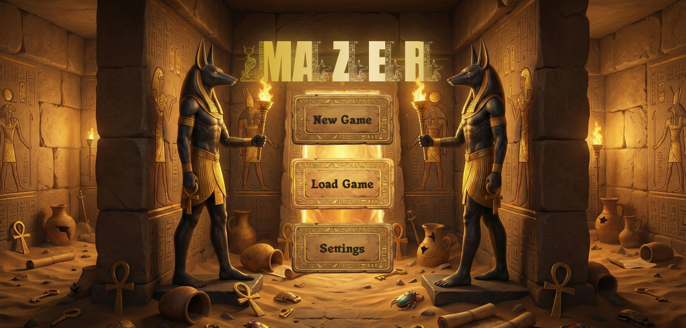
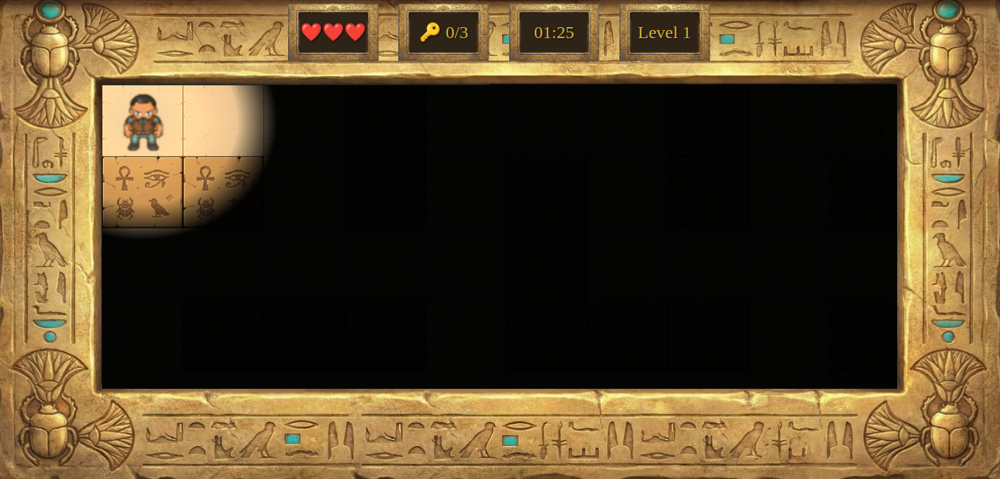
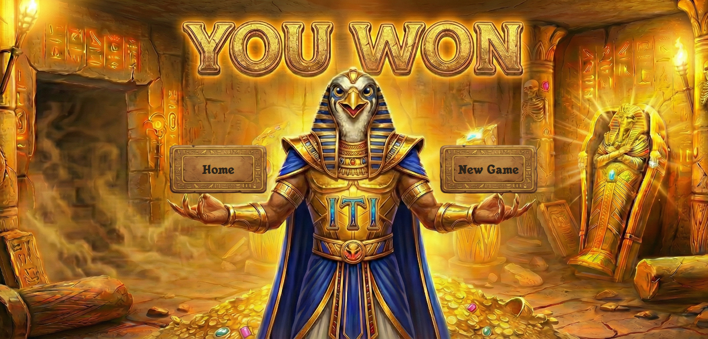

<div align="center">

```
███╗   ███╗ █████╗ ███████╗███████╗██████╗ 
████╗ ████║██╔══██╗╚══███╔╝██╔════╝██╔══██╗
██╔████╔██║███████║  ███╔╝ █████╗  ██████╔╝
██║╚██╔╝██║██╔══██║ ███╔╝  ██╔══╝  ██╔══██╗
██║ ╚═╝ ██║██║  ██║███████╗███████╗██║  ██║
╚═╝     ╚═╝╚═╝  ╚═╝╚══════╝╚══════╝╚═╝  ╚═╝
```

<h3>🏺 An Egyptian-Themed Maze Adventure Game 🏺</h3>

[](https://developer.mozilla.org/en-US/docs/Web/JavaScript)
[](https://developer.mozilla.org/en-US/docs/Web/HTML)
[](https://developer.mozilla.org/en-US/docs/Web/CSS)
[](https://developer.mozilla.org/en-US/docs/Web/API/Canvas_API)

[🎮 Play Live Demo](https://menna7634.github.io/Mazer-Project) • [📝 Report Bug](https://github.com/menna7634/Mazer-Project/issues) • [✨ Request Feature](https://github.com/menna7634/Mazer-Project/issues)


</div>

---

## 📜 About The Project

**Mazer** is a 2D maze adventure game built entirely with **vanilla JavaScript** (no frameworks, no game engines) as part of the **ITI Open Source Track - Intake 46** curriculum. Navigate through Egyptian-themed labyrinths, avoid deadly traps and mummies, collect ancient keys, and escape before time runs out!

### ✨ Key Features

- 🎮 **Pure Vanilla JS** – No frameworks, just clean JavaScript game logic
- 🗺️ **3 Challenging Levels** – Progressive difficulty with traps and enemies
- 👻 **Smart Enemy AI** – Mummies that patrol the maze with pathfinding
- 💾 **Save/Load System** – 3 save slots using localStorage
- 🎵 **Dynamic Audio** – Egyptian music and sound effects
- 📹 **Smooth Camera** – Follows player with viewport clamping
- 💡 **Dynamic Lighting** – Radial gradient darkness effect
- ⏱️ **Time-Based Challenges** – Complete levels before the timer runs out
- 🎨 **Custom Egyptian Theme** – Hand-crafted sprites, fonts, and UI

---

## 🎬 Screenshots

<div align="center">

| Home Screen | Gameplay | Victory |
|-------------|----------|---------|
|  |  |  |

</div>

---

## 🚀 Getting Started

### Prerequisites

- A modern web browser (Chrome, Firefox, Edge, Safari)
- A local web server (optional but recommended)

### Installation

1. **Clone the repository**
   ```bash
   git clone https://github.com/menna7634/Mazer-Project.git
   cd mazer
   ```

2. **Run with a local server** (recommended)
   ```bash
   # Using Python 3
   python -m http.server 8000
   
   # Using Node.js (http-server)
   npx http-server
   
   # Using PHP
   php -S localhost:8000
   ```

3. **Open in browser**
   ```
   http://localhost:8000
   ```

   **Or** simply open `index.html` directly (some features may not work without a server).

---

## 🎮 How to Play

### Controls

| Key | Action |
|-----|--------|
| `↑` | Move Up |
| `↓` | Move Down |
| `←` | Move Left |
| `→` | Move Right |
| `Esc` | Pause Menu |
| `S` | Quick Save |

### Game Mechanics

- **Objective:** Collect all 3 keys to unlock the exit door
- **Hearts (❤️):** Gems that restore 1 life
- **Keys (🔑):** Required to open the exit
- **Traps (🪲):** Scarab traps that reduce 1 life
- **Mummies (👻):** Moving enemies that reset your position
- **Timer:** Complete the level before time runs out!

### Level Progression

- **Level 1:** 90 seconds, 3 traps
- **Level 2:** 120 seconds, 3 mummies
- **Level 3:** 180 seconds, 3 traps + 3 mummies

---

## 🏗️ Project Structure

```
mazer/
├── assets/
│   ├── fonts/              # Custom Egyptian fonts
│   ├── images/
│   │   ├── frames/         # UI backgrounds and borders
│   │   ├── gameplay/       # Tiles, characters, items
│   │   ├── sprites/        # Player sprite sheets
│   │   └── traps/          # Trap animations
│   └── sounds/             # Music and SFX
├── css/
│   ├── base/               # Reset, variables, fonts
│   ├── components/         # Buttons, modals, HUD
│   └── screens/            # Screen-specific styles
├── js/
│   ├── core/               # Game.js, Timer.js, HUD.js
│   ├── enemies/            # Enemy logic and AI
│   ├── maze/               # Maze rendering and levels
│   ├── player/             # Player controller and movement
│   ├── storage/            # Save/load system
│   └── navigation.js       # Screen transitions
└── index.html
```

---

## 🧩 Technical Highlights

### Architecture Patterns

- **MVC-inspired structure:** Separation of game logic, rendering, and UI
- **Component-based design:** Reusable player, enemy, and camera modules
- **Event-driven controls:** Keyboard input handlers with debouncing
- **State management:** Centralized game state in Game.js

### Core Systems

```javascript
// Example: Player Movement System
class PlayerMovement {
  movePlayer(dx, dy) {
    const { x, y } = this.player.getPlayerPosition();
    const newX = x + dx, newY = y + dy;
    
    if (!this.canMoveTo(newX, newY)) return false;
    
    this.player.setPlayerPosition(newX, newY);
    this.player.setMoving(true);
    return true;
  }
}
```

### Canvas Rendering

- **Tile-based system:** 120x120px tiles with sprite atlases
- **Camera follow:** Smooth interpolation with boundary clamping
- **Layered rendering:** Background → Enemies → Player → Lighting
- **Sprite animation:** Frame-based character animations

### Save System

```javascript
// LocalStorage-based save slots
StorageSystem.saveToSlot(1, {
  level: 2,
  hearts: 3,
  keys: 1,
  time: 75,
  playerPosition: { x: 5, y: 3 },
  mazeState: [[0, 1, 0], ...]
});
```

---

## 🛠️ Technologies Used

- **JavaScript (ES6+)** – Classes, modules, async/await
- **HTML5 Canvas API** – 2D rendering
- **CSS3** – Animations, gradients, custom properties
- **LocalStorage API** – Save/load persistence
- **Web Audio API** – Background music and sound effects

---

## 👥 Team

This project was created by students from **ITI Open Source Track - Intake 46**:

<table>
  <tr>
    <td align="center">
      <a href="https://github.com/menna7634">
        <br />
        <sub><b>Menna</b></sub>
      </a><br />
      <sub> Player & Enemy Systems</sub>
    </td>
    <td align="center">
      <a href="https://github.com/Mostafa-Khalifaa">
        <br />
        <sub><b>Mostafa Khalifa</b></sub>
      </a><br />
      <sub>Game Logic & Mechanics</sub>
    </td>
    <td align="center">
      <a href="https://github.com/ahmed-ehab-reffat">
        <br />
        <sub><b>Ahmed Ehab Reffat</b></sub>
      </a><br />
      <sub>UI/UX Design & Styling</sub>
    </td>
    <td align="center">
      <a href="https://github.com/muhanadmedhat">
        <br />
        <sub><b>Muhanad Medhat</b></sub>
      </a><br />
      <sub>Game Architecture</sub>
    </td>
    <td align="center">
      <a href="https://github.com/muhammad-khaled-tech">
        <br />
        <sub><b>Muhammad Khaled</b></sub>
      </a><br />
      <sub>Project Lead & UI/UX Design </sub>
    </td>
  </tr>
</table>

---

## 📝 Lessons Learned

### What We Learned

- ✅ Game loop implementation with `requestAnimationFrame`
- ✅ Collision detection and grid-based movement
- ✅ Sprite animation and state machines
- ✅ Camera systems and viewport management
- ✅ Event-driven programming patterns
- ✅ Code organization without frameworks

### Challenges Faced

- 🔧 **Enemy Pathfinding:** Implementing simple AI without libraries
- 🔧 **Smooth Movement:** Interpolating sprite positions vs. grid positions
- 🔧 **Save State:** Serializing complex game state to JSON
- 🔧 **Performance:** Optimizing canvas redraws for 60fps

---

## 🔮 Future Enhancements

- [ ] Additional levels with new mechanics (ice floors, teleporters)
- [ ] Boss fights at the end of each world
- [ ] Leaderboard system with online persistence
- [ ] Mobile touch controls
- [ ] Procedural maze generation
- [ ] Power-ups (speed boost, invincibility, extra time)
- [ ] Achievements system

---

## 📄 License

This project is licensed under the MIT License - see the [LICENSE](LICENSE) file for details.

---

## 🙏 Acknowledgments

- **ITI Open Source Track** – For the amazing learning experience
- **ITI Open Source Track Instructors** – For guidance and code reviews
- **Fonts** – Egyptian Bookends, Anubis fonts - Free fonts from various sources
- **Sprites & Art** – AI-generated pixel art and custom graphics
- **Sound Effects** – Royalty-free Egyptian music - Various online sources

---

<div align="center">

**Made with ❤️ by ITI Open Source Track - Intake 46**

[⬆ back to top](#)

</div>